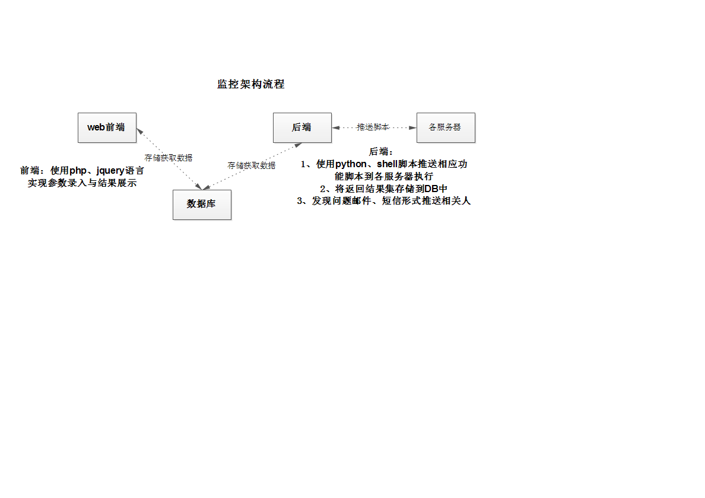
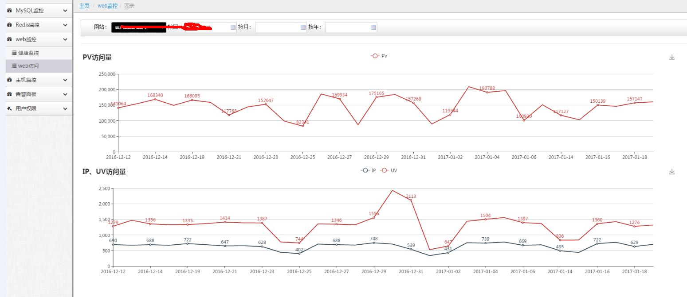
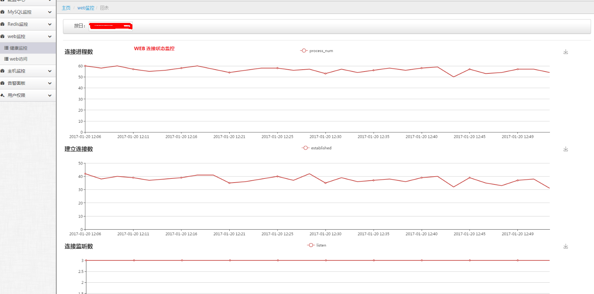
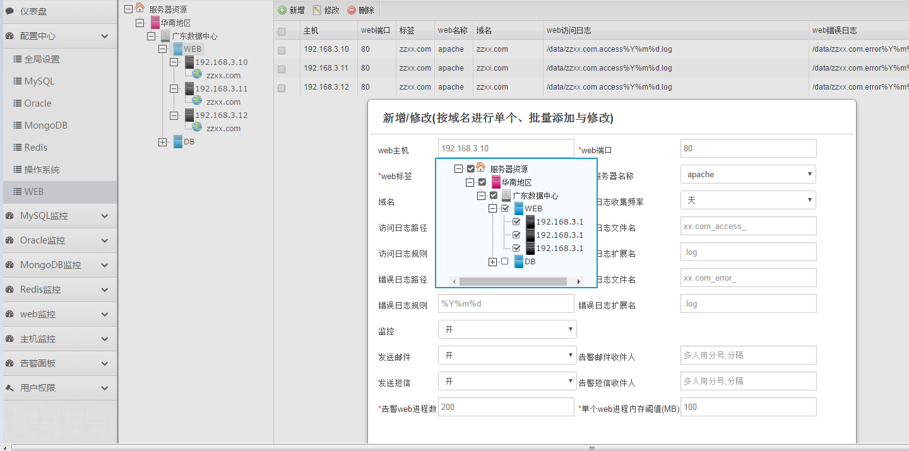
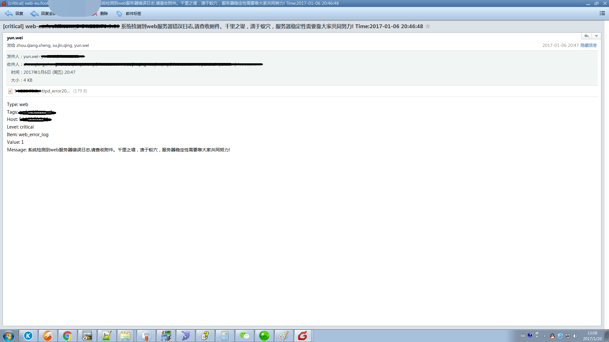
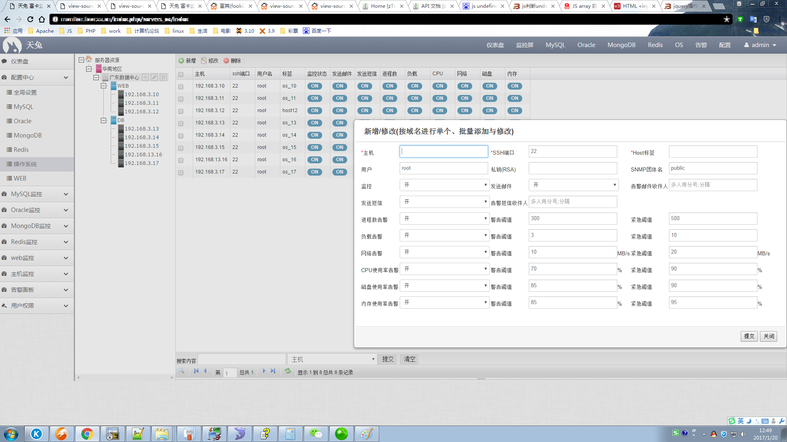

### Lepus monitoring system:
**1. OS performance, MySql, Oracle, MongoDB, Redis <br>**
**2. WEB process number, process memory monitoring, TCP connection number monitoring, PV, UV, IP value statistics, web error log timely reminder**
### Process












### Development environment required:
centos7+php5.6+mysql5.6+apache+python2.7

### Sample configuration:
Monitoring WEB server IP: 192.168.3.59 <br>
Monitoring DB server IP: 192.168.3.60 <br>
Scripts are stored in the directory: /data/www/ <br>
Client IP: 192.168.3.15 <br>
#### 1. Backend python configuration
yum install -y python-devel MySQL-python python-paramiko mysql python2-pip <br>
pip install redis <br>
pip install redis-py-cluster <br>
pip install cx_oracle pymongo pymssql <br>

Configure database IP, user, password path:
cd /data/www/lepus/lepus/etc <br>
1. cd /data/www/lepus/lepus <br>

Modify directory path: basedir="/data/www/lepus/lepus" <br>
2. Start <br>
./lepus start <br>

#### 2. Front-end WEB configuration <br>
cd /data/www/lepus/web/application/config <br>
Configure the config.php file $config['base_url'] = 'http://xxxx/; <br>
Configure the database.php connection information <br>

Note:
Login user admin password 123abc <br>
Change password sql: <br>
UPDATE admin_user SET `password`=MD5('123ab') WHERE username='admin'; <br>

Upgrade user update sql, only execute sql/update_web.sql <br>
New user update sql order: sql/lepus_table.sql, lepus_data.sql, update_web.sql <br>

#### 3. Obtain the web server client SSH key <br>
Since the web server access log, pv, uv information is obtained, ssh key login is required <br>
On the client 192.168.3.15 <br>
Use the -f and -P parameters of ssh-keygen to generate keys without interaction <br>
ssh-keygen -t rsa -f ~/.ssh/id_rsa -P '' <br>
cp ~/.ssh/id_rsa.pub ~/.ssh/authorized_keys <br>
Copy id_rsa content interface: Configuration Center-> Operating System-> Add or modify the RSA box under the corresponding host <br>

#### 4. Configure web logs, PV, IP, UV
1. Install the log separation tool: yum install -y cronolog <br>

2. Apache log format: <br>

Add UV value
vim httpd.conf
Enable mod_usertrack module <br>
```LoadModule usertrack_module libexec/mod_usertrack.so
<IfModule usertrack_module>
CookieExpires "1 weeks"
CookieStyle cookie
CookieName your_cookie_name
CookieTracking on
</IfModule>
```

Record the real client IP address in the access log <br>
SetEnvIf X-Forwarded-For "^.*\..*\..*\..*" forwarded <br>
Add the %{cookie}n field at the end of the log LogFormat <br>
LogFormat "%{X-Forwarded-For}i %{cookie}n %{%Y-%m-%d %H:%m:%S}t %r %>s %b \"%{Referer}i\" \"%{User-Agent}i\"" common <br>
X-Forwarded-For Client IP <br>
Cookie refers to UV value <br>
%Y-%m-%d %H:%m:%S Access date and time <br>
%r The corresponding format of the requested line is "%m %U%q %H", that is, "request method/access path/protocol" <br>
Note: Do not change the order and parameters of the log format, otherwise you need to change the /data/www/lepus/lepus/check_web_log.sh script file;
Of course, you also need to modify the check_web_log.sh script to exclude non-dynamic URLs for web access, such as css, image, and upfile directories
<br>
Configure web access log format: <br>

CustomLog "|/usr/sbin/cronolog /data/server/httpd/logs/xx.com-access_%Y%m%d.log" common env=forwarded <br>
xx.com-access_%Y%m%d.log is separated by day %Y%m%d, corresponding interface: Configuration Center->Operating System->Add or modify the corresponding "Access Log Rules" <br>

3. nginx log format configuration <br>
nginx add uv <br>
```
http {
log_format main '$http_x_forwarded_for $uid $http_x_cookie $time_iso8601 $request $remote_addr - $remote_user [$time_local] "$request" $st
atus $body_bytes_sent "$http_referer" "$http_user_agent" "$http_x_forwarded_for"';
}

server {
set $uid "-";
if ( $http_cookie ~* "uid=(\S+)(;.*|$)")
{
set $uid $1;
}
}
```
Note: Do not change the log format order and parameters, otherwise you need to change the /data/www/lepus/lepus/check_nginx_web_log.sh script file; <br>

If you need help, please add wechat: 271416962